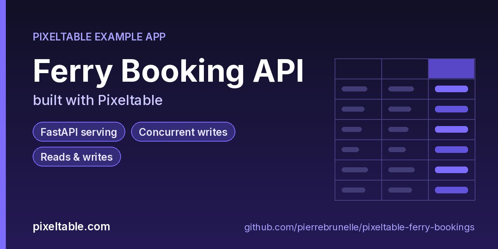

<!-- pixeltable-example-app: 20261007-ferry-bookings -->
# Ferry Booking API built with Pixeltable



[](https://codespaces.new/pierrebrunelle/pixeltable-ferry-bookings?quickstart=1)
[](https://pixeltable.com)
[](https://pypi.org/project/pixeltable/)
[](https://github.com/pixeltable/pixeltable)
[](LICENSE)

A small, complete ferry booking backend in one Python file. Two tables (`sailings` and `bookings`) are declared as Python classes; every booking's fare, deck class and UUIDv7 id are **incremental computed columns** calculated by Python UDFs the moment a row is inserted or updated, and recomputed automatically when an input changes. A single `FastAPIRouter` turns the tables and queries into a typed REST API with insert, update, delete, compute ("quote") and query routes, OpenAPI docs included, and the same file deploys unchanged to Pixeltable Cloud.

[Pixeltable](https://pixeltable.com) is open-source, Python-native **multimodal AI data infrastructure**: tables, incremental computed columns, UDFs, indexes and serving in one library, running locally or on Pixeltable Cloud.

> ⭐ **Like this example?** Star [pixeltable/pixeltable](https://github.com/pixeltable/pixeltable) on GitHub. It helps other developers find it.

## What this example shows

- **FastAPI serving**: one `FastAPIRouter` turns tables and `@pxt.query` functions into typed REST routes (insert, update, delete, compute and query) with OpenAPI docs
- **Concurrent writes**: parallel HTTP clients inserting into and updating the same table
- **Reads and writes**: Json columns, primary-key updates and deletes, and quick inspection with the `pxt` CLI (`pxt rows`, `pxt get`, `pxt count`)
- **Incremental computed columns** powered by plain Python UDFs (`@pxt.udf`)
- **B-tree indexes** declared on the model (`__indexes__`) back the lookup queries
- **Importable UDF module**: UDFs live in `udfs.py`; tables, queries and routes live together in `app.py` (Pixeltable resolves UDFs by module path)
- **`pixeltable.toml`** declares a local database and a **Pixeltable Cloud** database, so the same code deploys with `pxt db update`


## What's inside

| File | What it is |
|------|------------|
| `.devcontainer/devcontainer.json` | GitHub Codespaces / Dev Container config: Python 3.12, installs `requirements.txt`, forwards port 8000 |
| `.github/social-preview.png` | Social preview image (1280x640) |
| `CITATION.cff` | Citation metadata (authors, license, release date, keywords) |
| `app.py` | The app: tables declared as Python classes, `@pxt.query` functions, and the `FastAPIRouter` routes |
| `client_demo.py` | Call every route of the ferry booking API, then book 12 seats in parallel |
| `pixeltable.toml` | Project config: the local database plus a Pixeltable Cloud database (sizing, deploy excludes) |
| `seed.py` | Seed a few ferry sailings so the /sailings and /manifest routes have data to show |
| `udfs.py` | Pixeltable UDFs (`@pxt.udf`) in their own importable module, imported by `app.py` |
| `requirements.txt` / `pyproject.toml` | Dependencies (`pixeltable[serve]>=0.7.14`) |

**Tables**

| Table | Stored columns | Computed columns |
|-------|---------|------------------|
| `sailings` | `sailing_id`, `route`, `depart_at`, `vessel`, `pax_capacity` | - |
| `bookings` | `sailing_id`, `lead_name`, `party_size`, `vehicle_len_m`, `extras`, `status` | `booking_id`, `fare`, `deck_class`, `extras_order` |

**API routes** (service `booking_api`)

| Method | Path | Kind | Backed by | Notes |
|--------|------|------|-----------|-------|
| `POST` | `/bookings` | insert | `Bookings` |  |
| `POST` | `/bookings/update` | update | `Bookings` |  |
| `POST` | `/bookings/cancel` | delete | `Bookings` |  |
| `POST` | `/quote` | compute | `Bookings` |  |
| `POST` | `/manifest` | query | `manifest` |  |
| `GET` | `/manifest-get` | query | `manifest` |  |
| `GET` | `/booking/by-lead` | query | `booking_by_lead` | one row (404 if none) |
| `GET` | `/sailings` | query | `sailings_on_route` |  |
| `POST` | `/quote-v2` | compute | `Bookings` |  |

## Run in your browser (GitHub Codespaces)

[](https://codespaces.new/pierrebrunelle/pixeltable-ferry-bookings?quickstart=1)

1. Click **Open in GitHub Codespaces** above (or [this link](https://codespaces.new/pierrebrunelle/pixeltable-ferry-bookings?quickstart=1)). The dev container installs Python 3.12 and `pixeltable[serve]>=0.7.14` from `requirements.txt`.
2. In the codespace terminal, create the tables, seed them and start the API:

   ```bash
   pxt schema update app.py ferry
   python seed.py ferry                      # a few sample sailings
   pxt service run app.py ferry --port 8000  # serves booking_api; open http://localhost:8000/docs
   python client_demo.py                     # in another terminal: calls every route, then 12 parallel bookings
   ```

3. Codespaces forwards port 8000: open it from the **Ports** tab (or the pop-up) and add `/docs` to the URL for the interactive OpenAPI docs.

## Quickstart

Requires Python 3.11+ and `pixeltable[serve]>=0.7.14`.

```bash
git clone https://github.com/pierrebrunelle/pixeltable-ferry-bookings.git
cd pixeltable-ferry-bookings
python -m venv .venv && source .venv/bin/activate
pip install -r requirements.txt

# Create the tables in a local catalog directory named `ferry`
pxt schema update app.py ferry

python seed.py ferry                      # a few sample sailings
pxt service run app.py ferry --port 8000  # serves booking_api; open http://localhost:8000/docs
python client_demo.py                     # in another terminal: calls every route, then 12 parallel bookings
```

Try it:

```bash
curl -s -X POST localhost:8000/quote -H 'Content-Type: application/json' -d '{"party_size": 2, "vehicle_len_m": 6.1, "extras": {"cabin": true}}'
curl -s -X POST localhost:8000/bookings -H 'Content-Type: application/json' -d '{"sailing_id": "S1001", "lead_name": "Ada Lovelace", "party_size": 3, "vehicle_len_m": 4.6, "extras": {"bikes": 2}, "status": "held"}'
curl -s 'localhost:8000/manifest-get?sailing_id=S1001'
```

## Deploy to Pixeltable Cloud

The same `app.py` runs on [Pixeltable Cloud](https://pixeltable.com). Sign in (or get a free trial database with `pxt new`), point the second database entry in `pixeltable.toml` at your own database, then deploy:

```bash
pxt login                       # or: export PIXELTABLE_API_KEY=<your-api-key>
# edit pixeltable.toml: name = 'pxt://<your-org>:<your-db>'
pxt db update pxt://<your-org>:<your-db>                 # build the image and upload the project
pxt schema update app.py pxt://<your-org>:<your-db>/ferry   # create the tables in the hosted database
pxt service update app.py pxt://<your-org>:<your-db>/ferry  # start the API there
pxt service list pxt://<your-org>:<your-db>              # list hosted services
```

Hosted routes require an API key: send it in the `X-api-key` header (for example `-H "X-api-key: $PIXELTABLE_API_KEY"`). Keep keys in environment variables or `pxt secret set`, never in code.

## Code walkthrough

**1. Business logic is plain Python, in `udfs.py`.** A `@pxt.udf` function can be used as a column expression. Pixeltable records UDFs by module path (`udfs.fare_cents`), so they live in their own importable module rather than inline in the app: the daemon, serving workers and Pixeltable Cloud import it again by that path.

```python
# udfs.py
@pxt.udf
def fare_cents(party_size: int, vehicle_len_m: float | None, extras: dict | None) -> int:
    """Fare: per-person base + vehicle length + priced extras (bikes, pets, cabin)."""
    if party_size is None or party_size < 1:
        raise ValueError(f'party_size must be >= 1, got {party_size}')
    total = BASE_FARE_CENTS * party_size
    if vehicle_len_m:
        total += int(round(vehicle_len_m * VEHICLE_CENTS_PER_M))
    ex = extras or {}
    total += 600 * int(ex.get('bikes', 0) or 0)
    total += 450 * int(ex.get('pets', 0) or 0)
    if ex.get('cabin'):
        total += 4900
    return total
```

**2. Tables are Python classes (`app.py`).** Annotated attributes are stored columns; attributes assigned an expression are **computed columns** (`booking_id`, `fare`, `deck_class`, `extras_order`), evaluated incrementally on every insert or update and recomputed when their inputs change. Indexes live next to the columns.

```python
# app.py
class Bookings(TableModel, name='bookings', has_default_idxs=False):
    booking_id = pxt.Column(value=pxtf.uuid.uuid7(), primary_key=True)
    sailing_id: pxt.String
    lead_name: pxt.String
    party_size: pxt.Int
    vehicle_len_m: pxt.Float | None
    extras: pxt.Json | None
    status: pxt.String

    # computed columns: evaluated on insert/update, recomputed when inputs change
    fare = fare_cents(party_size, vehicle_len_m, extras)
    deck_class = deck(vehicle_len_m)
    extras_order = extras_keys(extras)

    __indexes__ = [pxt.BtreeIndex(sailing_id), pxt.BtreeIndex(status)]
```

**3. Queries are functions (`app.py`).** `@pxt.query` wraps a Pixeltable query so it can be called from Python or exposed as a route:

```python
# app.py
@pxt.query
def manifest(sailing_id: str):
    """All bookings on a sailing (index-backed)."""
    return (
        Bookings.where(Bookings.sailing_id == sailing_id)
        .select(Bookings.booking_id, Bookings.lead_name, Bookings.party_size, Bookings.deck_class,
                Bookings.fare, Bookings.status)
        .order_by(Bookings.lead_name)
    )
```

**4. One router, a full REST API.** `FastAPIRouter` generates request/response models from the column types, validates input, and publishes OpenAPI docs at `/docs`:

```python
# app.py
booking_api = FastAPIRouter(name='booking_api')
booking_api.add_insert_route(
    Bookings,
    path='/bookings',
    inputs=[Bookings.sailing_id, Bookings.lead_name, Bookings.party_size, Bookings.vehicle_len_m,
            Bookings.extras, Bookings.status],
    outputs=[Bookings.booking_id, Bookings.fare, Bookings.deck_class, Bookings.extras, Bookings.extras_order],
)
booking_api.add_update_route(
    Bookings,
    path='/bookings/update',
    inputs=[Bookings.status, Bookings.party_size],
    outputs=[Bookings.booking_id, Bookings.status, Bookings.party_size, Bookings.fare],
)
booking_api.add_delete_route(Bookings, path='/bookings/cancel')
booking_api.add_compute_route(
    Bookings,
    path='/quote',
    inputs=[Bookings.party_size, Bookings.vehicle_len_m, Bookings.extras],
    outputs=[Bookings.fare, Bookings.deck_class],
)
booking_api.add_query_route(path='/manifest', query=manifest)
booking_api.add_query_route(path='/manifest-get', query=manifest, method='get')
booking_api.add_query_route(path='/booking/by-lead', query=booking_by_lead, one_row=True, method='get')
# ... more routes in app.py
```

## Learn more

- 🌐 Website: https://pixeltable.com
- 📚 Docs: https://docs.pixeltable.com
- 💻 Source: https://github.com/pixeltable/pixeltable (⭐ star it if Pixeltable is useful to you)
- 📦 PyPI: https://pypi.org/project/pixeltable/
- 🧩 More example apps: https://pierrebrunelle.github.io/awesome-pixeltable-apps/

**[More Pixeltable example apps →](https://pierrebrunelle.github.io/awesome-pixeltable-apps/)**

---

<sub>Built as part of a daily series of Pixeltable example apps · Pixeltable 0.7.14 · Python, FastAPI, incremental computed columns · Licensed under Apache-2.0.</sub>
